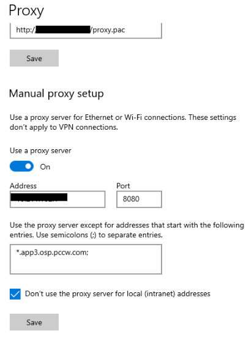
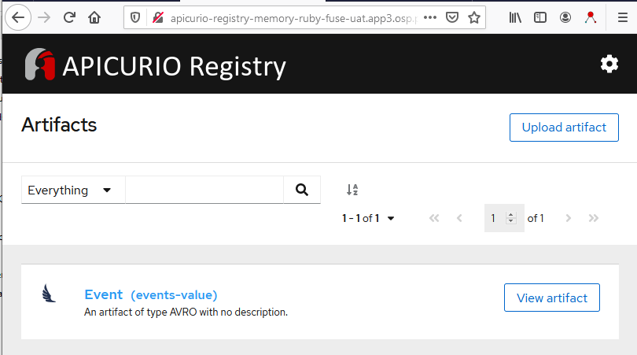
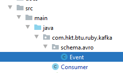
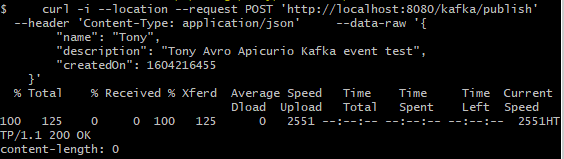
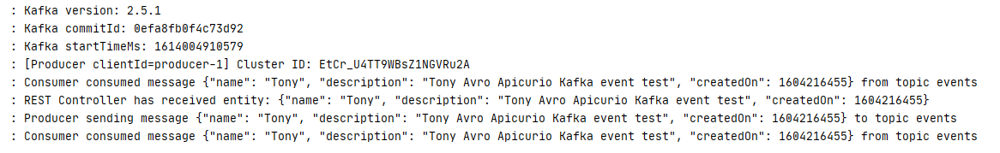

# spring-boot-kafka-apicurio

This projects show example of how to integrate spring-boot, apache kafka, apicurio registry (avro schema format)

### 1. Preconditions
#### 1.1 Use HKT internal network for your testing
#### 1.2 Add host table as below and add ```*.app3.osp.pccw.com;``` in proxy except (settings > search proxy > Proxy settings). 

    10.168.104.4 kafka-ui-ruby-common-tools-sit.app3.osp.pccw.com
    10.168.104.4 apicurio-registry-memory-ruby-fuse-uat.app3.osp.pccw.com
    10.168.104.4 msghub-ft-a.hkt.com


Kafka UI Tool:
https://kafka-ui-ruby-common-tools-sit.app3.osp.pccw.com/

Apicurio Registry:
http://apicurio-registry-memory-ruby-fuse-uat.app3.osp.pccw.com/

OpenShift Common Tool SIT env:
https://master3.osp.pccw.com:8443/console/project/ruby-common-tools-sit/overview

### 2. Quick test in local 
#### 2.1 Start application (skip build by using existing target files)
    mvn spring-boot:run
#### 2.2 Send a rest request to produce and consume events 
    curl -i --location --request POST 'http://localhost:8080/kafka/publish' \
    --header 'Content-Type: application/json' \
    --data-raw '{
        "name": "Tony",
        "description": "Tony Avro Apicurio Kafka event test",
        "createdOn": 1604216455
    }'
### 3. Customize Application for your case
#### 3.1 Update configuration of application.yaml (group-id and etc) and your topic name
    spring.kafka.consumer.group-id: events-group

    public class Topic {
        public static final String NAME = "events";
    }

Update pom.xml with your Avro schema artifact, example```events-value```.
    
    <artifactType>AVRO</artifactType>
    <artifacts>
      <events-value>${project.basedir}/src/main/resources/avro/schema/event.avsc</events-value>
    </artifacts>
    <ids>
      <param1>events-value</param1>
    </ids>
    
#### 3.2 Import the event avro schema ```mvn clean install -DskipTests -Pupload``` or use the curl command to uplpad ```event.avsc``` to Apicurio Registry
    
    curl --location --request POST 'http://apicurio-registry-memory-ruby-fuse-uat.app3.osp.pccw.com/api/artifacts' \
    --header 'Content-Type: application/json; artifactType=AVRO' \
    --header 'X-Registry-ArtifactId: events-value' \
    --data-raw '{
      "name": "Event",
      "namespace": "com.hkt.btu.ruby.kafka.schema.avro",
      "type": "record",
      "doc": "Avro Schema for Event",
      "fields" : [ {
        "name" : "name",
        "type" : "string"
      }, {
        "name" : "description",
        "type" : "string"
      }, {
        "name" : "createdOn",
        "type" : "int",
        "logicalType": "timestamp-millis"
      }
      ]
    }'
Apicurio Registry UI Console as below :

    

#### 3.3 Generate event class source code by ```event.avsc``` file

    mvn clean install -DskipTests -Pavro
 

#### 3.4 Build and package

    mvn clean package
    
#### 3.5 Run application

    mvn spring-boot:run

#### 3.6 Send a rest request to produce and consume events 

    curl -i --location --request POST 'http://localhost:8080/kafka/publish' \
    --header 'Content-Type: application/json' \
    --data-raw '{
        "name": "Tony",
        "description": "Tony Avro Apicurio Kafka event test",
        "createdOn": 1604216455
    }'
        
#### 3.7 Result
      
    
### 4. Maven Profiles for apicurio

### build Event Class from event.avsc
```mvn clean install -DskipTests -Pavro```
### upload schema to registry
```mvn clean install -DskipTests -Pupload```

### download schema to src/main/
```mvn clean install -DskipTests -Pdownload```

### 5. Reference: 
Extract Kafka secret and import it into a java keystore (don't need to do it, just FYI)
```
oc extract secret/msghub-ft-a-cluster-ca-cert  -n msghub-ft-a --keys=ca.crt --to=- > ca-crt.pem

keytool -import -file ca-crt.pem -keystore ./msghub-ft-a.truststore.jks -storepass password
```

